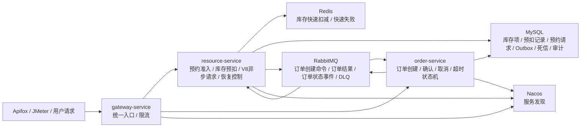
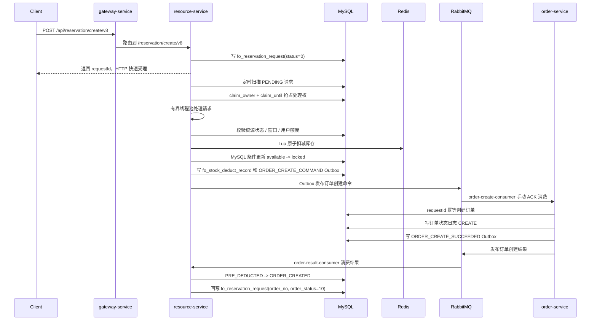
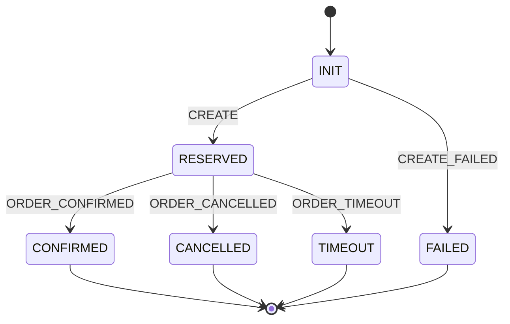
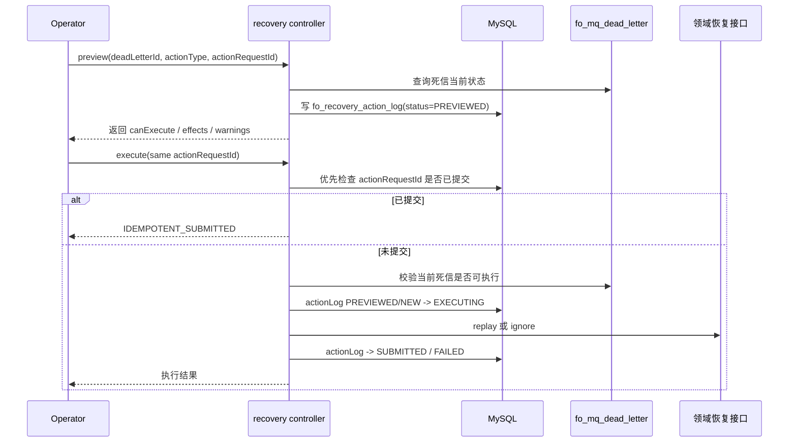

# FlowOrder 架构与主流程图

更新时间：2026-07-08

FlowOrder 的定位是“高并发预约交易与履约一致性平台”。核心不是接口数量，而是围绕预约准入、异步受理、库存预扣、订单履约和异常恢复，证明并发正确性、可靠消息和最终一致性。

## 1. 整体架构



关键边界：

| 服务 | 领域职责 |
| --- | --- |
| `resource-service` | 资源状态、预约窗口、用户额度、库存预扣、预约请求、订单结果/状态消费、恢复控制面 |
| `order-service` | 订单创建、订单查询、确认、取消、超时关闭、订单状态日志、订单侧 Outbox |
| `gateway-service` | 统一入口、路由、基础限流 |

数据库虽然开发环境共用一个 `floworder` schema，但设计上不跨服务随意修改对方领域表。

## 2. V8 异步预约主链路



主链路不变量：

```text
total_stock = available_stock + locked_stock + sold_stock
```

并发正确性边界：

| 风险 | 兜底机制 |
| --- | --- |
| 并发超卖 | Redis Lua 快速原子扣减 + MySQL `available_stock >= quantity` 条件更新 |
| 重复提交 | `requestId` 唯一索引 + 参数一致性校验 |
| 请求丢失 | V8 先写 `fo_reservation_request`，再异步处理 |
| 多实例重复处理 | `claim_owner` / `claim_until` 数据库租约抢占 |
| MQ 发送失败 | Outbox 状态机、重试、租约回收、`DEAD` |
| 消费重复 | `messageId + consumerGroup` 消费幂等 |

## 3. 订单履约状态机



订单状态事件驱动 resource-service 更新库存：

| 订单事件 | 订单状态 | 库存预扣状态 | 库存字段变化 |
| --- | --- | --- | --- |
| `ORDER_CONFIRMED` | `20 CONFIRMED` | `60 SOLD` | `locked_stock -> sold_stock` |
| `ORDER_CANCELLED` | `30 CANCELLED` | `30 RELEASED` | `locked_stock -> available_stock` |
| `ORDER_TIMEOUT` | `40 TIMEOUT` | `30 RELEASED` | `locked_stock -> available_stock` |

已形成证据：

- 确认链路：见 `docs/reports/v12/01-main-flow-evidence.md`。
- 取消链路：见 `docs/reports/v12/01-main-flow-evidence.md`。
- 超时链路：见 `docs/reports/v12/04-timeout-close-evidence.md`。

## 4. V10 恢复控制链路



`SUBMITTED` 表示恢复命令已可靠提交，不等于订单、库存和死信已经完成业务收敛。

恢复控制面原则：

| 规则 | 说明 |
| --- | --- |
| 默认不暴露 | `floworder.admin.enabled=false` 时 `/internal/recovery/**` 不注册 |
| 先预览后执行 | `preview` 只判断可执行性和影响范围，不直接改业务状态 |
| 幂等执行 | `execute` 使用 `actionRequestId` 防止重复恢复 |
| 领域边界 | recovery 不直接修改订单或库存核心状态，恢复动作委托领域服务 |
| 审计留痕 | `fo_recovery_action_log` 记录 operator、reason、previewResult、executeResult |

## 5. 面试讲解顺序

建议按以下顺序讲，不要从技术栈开始：

```text
1. 业务问题：高并发预约下不能超卖，订单履约和异常恢复必须最终一致。
2. 同步基线：Redis Lua + MySQL 条件更新 + requestId 幂等。
3. 异步化：V8 请求先落库，数据库租约 + 有界线程池处理。
4. 可靠消息：Outbox + RabbitMQ + Confirm + 手动 ACK + 消费幂等 + DLQ。
5. 履约闭环：确认、取消、超时通过订单状态事件驱动库存 SOLD/RELEASED。
6. 恢复控制：preview/execute + actionRequestId 幂等 + 审计日志。
7. 证据：JMeter、SQL 库存恒等式、状态收敛、自动化测试和故障记录。
```

## 6. 不夸大的边界

当前可以说明 FlowOrder 具备“面向生产问题的设计和本地可验证证据”，但不要直接宣称：

- 生产级高可用系统；
- 完整运营后台；
- 多级缓存平台；
- 分库分表系统；
- Kubernetes 云原生部署；
- 完整监控告警平台。

这些能力没有形成对应部署、监控、故障切换或容量验证证据，面试中只能作为后续优化方向。
